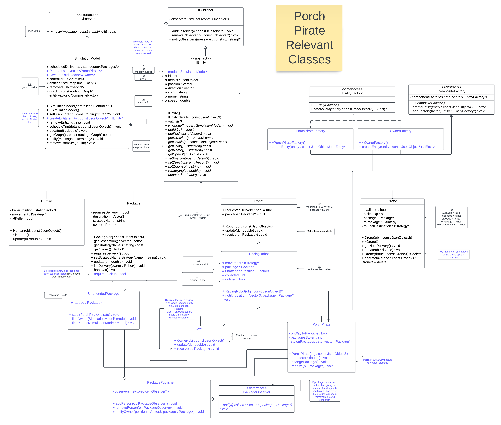
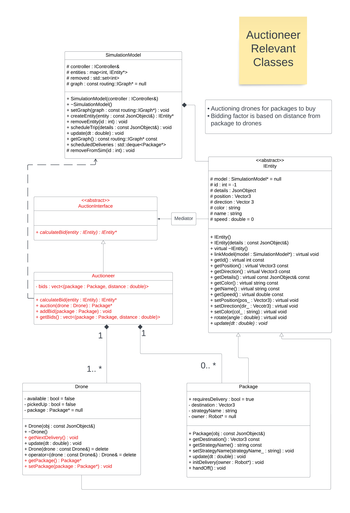

# Drone Delivery Simulation on the University of Minnesota Campus
### Group 49: Greta, Nate, Jose, Dana

## The project:
Our project is a drone delivery simulation, which allows a user to simulate package deliveries on the University of Minnesota East Bank campus. In the simulation, drones deliver packages from a source to a destination for a target robot to pick up. The user can also select which path strategy for the drones to have, such as AStar, Dikjstra's, or Beeline. The simulation contains a helicopter as well, which surveils the map. The project has two extensions, first, a Porch Pirate extension that allows for the possibility of package theft and second, an Auctioneer extension that makes drone delivery more efficient.

## Running the Simulation and its Capabilities: 

There are several ways to run the simulation. The first option is clone this github repository in one of the CSE lab machine that runs Ubuntu. Locate the corresponding folder, open this folder in the terminal and execute the following commands:
```
make clean
```
```
make -j
```
```
make run
```
After this, open the browser of your preference, and type http://localhost:8081/ in the address bar. The second option of running the simulation is to use the DockerHub links provided here:

For M1/M2/M3 mac users, the following link is the DockerHub repository for the simulation:
- [Docker Link 001-49](https://hub.docker.com/repository/docker/joseap14/final_project_001-49_mac/general)

To run the simulations in the desired M1/M2/M3 Mac, open the Docker application, open a terminal and execute the following commands: 
```
docker pull joseap14/final_project_001-49_mac
```
```
docker run --rm -it -p 8081:8081 joseap14/final_project_001-49_mac
```
After this, open the browser of your preference, and type http://localhost:8081/ in the address bar. 

In the simulation it is possible to observe a helicopter flying around, schedule deliveries from any location to any other location the user pinpoints. Spawn porch pirates, humans and more drones with a button. 

## Porch Pirates Extension:

The porch pirates extension simulates package theft. When the delivery system drops the package off, the package is left unattended. The unattended packages are in danger of being stolen before customers make it home. "Porch Pirates", spawned randomly in the simulation, roam aimlessly unless they witness a package drop off. If they witness a drop off, they try to steal the package. If successful, the delivery system is alerted. When the owner returns home, if they find their package has been stolen, they leave an angry review. If they find their package delivered safely, they leave a positive review.  

This extension is significantly interesting because a company should be quite interested in the danger packages face being left alone when delivered during a normal workday. Companies can simulate high and low crime areas, witness theft risk and get a rough estimate of customer satisfaction rates using the reviews left by customers. 

We used several design patters. Firstly, we extended the factory pattern. It compartmentalizd porch pirate and owner object creation away from the main entity creation function. We also reimplemented an Observer pattern. Ours allows the publisher to modify the observers as opposed to the original observer pattern that utilized const values. The UnattendedPackage acted as the publisher,  the owner and nearby porch pirates observed when a package had been delivered. We used a decorator pattern to extend the capabilities of the package. It handled the porch pirates ability to steal without modifying the already existing package code.

Feature is user interactable. Each scheduled package owner's name needs to be unique. Populate simulation using "add pirate" button. 15-20 pirates is a good ratio for simple testing. Schedule 5-7 deliveries. Jobs are randomly assigned to robots, so it is not possible to know whether a package's drop off location will be close to the robot's job before spawning. A robot may work at Coffman, Keller, Korean Bistro (next to Dominos/Jimmy John's), Anderson Hall (West Bank) or Tate. Owners will always leave a review on the screen positive or negative. Porch Pirates only send a message to the screen if they steal a package.

## Auctioneer Extension:

The Auctioneer extension adds new functionality to the package scheduling system. Whereas previously packages were assigned to drones at random, the new auctioneering system assigns a scheduling to the closest drone-package pair. Whenever a drone is available, a new auction will start which looks at all available drones and unscheduled packages. Packages bid on drones, with packages who are closer bidding higher. Then, all bids are compared across all package-drone pairings, and the overall highest bid is chosen for scheduling. 

We used the mediator design pattern for the new scheduling system. Our mediator stands between drones and packages, creating a successful assignment between available groups. 

This extension proves interesting as it improves the overall efficiency of package deliveries. In situations of low traffic, closer drones will be scheduled, reducing travel time. In situations of high traffic, drones will prioritize closer packages to also reduce travel time. Any business who is using the current system of random assignments would benefit from this improved scheduling system, as it reduces customer wait times and cost of drone travel.

The feature does not require any additional user input, simply schedule multiple deliveries. 

## Sprint Retrospective:
Went well:
- Division of labor felt fair and considerate to each team mates schedule
- Communication was prompt and effective
- All team members respected deadlines

Problems encountered:
- Team mate schedules did not overlap, so features could not be developed concurrently
- Miscommunications with pushing to github
- Incorrect interpretation of directions led to confusion in implementation

Solutions vs failures:
- To solve scheduling and feature creation, the Jira board was incredibly great for organization and communication
- Version control in github allowed us to always have a working version, so struggles with misordered pushing could always be resolved
- Consistant in-person meetings allowed for a flow of ideas and checks on groupmate's understandings
- Had to rewrite the auctioneer extension after direction misunderstanding had been caught

## UML
Porch Pirates:



Auctioneer:


## DockerHub link:
For M1/M2/M3 mac users, use the following link:
- [Docker Link 001-49](https://hub.docker.com/repository/docker/joseap14/final_project_001-49_mac/general)


## Youtube Video Presentation link:
https://youtu.be/7JvSza1CTeU
